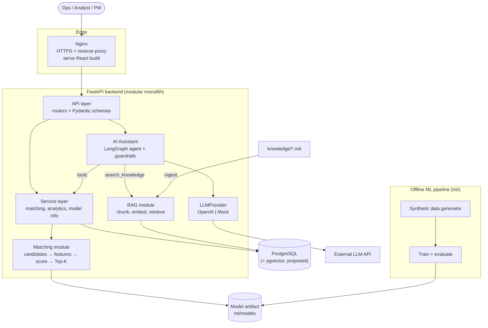
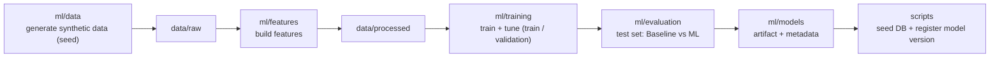
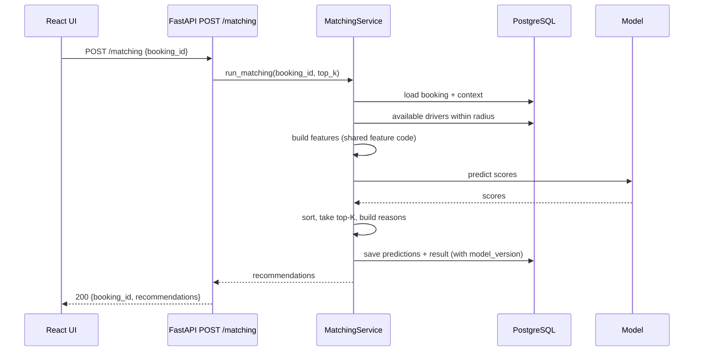
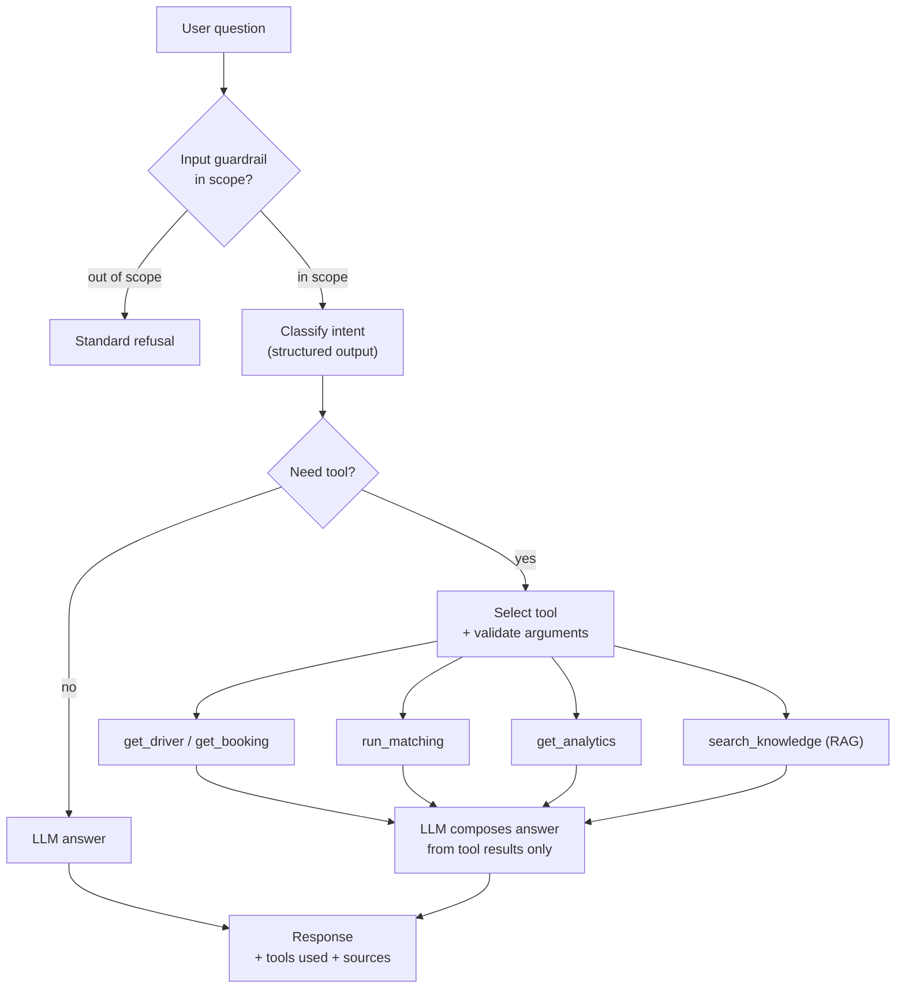
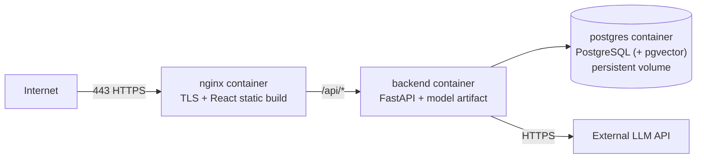

# SmartMatch AI — Architecture

| | |
|---|---|
| Version | 0.4 |
| Phase | 0 — Product Definition; cập nhật ở Phase 1, 2, 3 |
| Status | Draft. Các mục đánh dấu **Proposed** sẽ được chốt ở phase tương ứng. |
| Last updated | 2026-09-15 |

Tài liệu liên quan: [Product Requirements](product-requirements.md) · [Research](research.md).

---

## 1. Nguyên tắc kiến trúc

1. **Modular monolith.** Một backend FastAPI chia module rõ ràng. Không microservices: một người phát triển, một database, tải thấp —
   tách service chỉ thêm network hop và độ phức tạp deploy mà không giải quyết vấn đề nào đang có.
2. **Tách offline và online.** Training/evaluation chạy offline trong `ml/`. Backend chỉ load artifact đã train để inference, không train model.
3. **ML ranks, LLM talks.** Ranking do ML model thực hiện. LLM chỉ hiểu câu hỏi, chọn tool, diễn đạt kết quả. LLM không bao giờ là nguồn số liệu.
4. **LLM không chạm trực tiếp vào database.** `LLM → predefined tool → Pydantic validation → service → DB`. Không có đường `LLM → raw SQL`.
5. **Interface cho những thứ hay thay đổi**: LLM provider, embedding provider, model artifact.
6. **Config qua environment variables**; secrets chỉ nằm trong `.env`.
7. **Chỉ thêm hạ tầng khi có số đo chứng minh cần** (Redis, message queue, Prometheus...).

---

## 2. System context



---

## 3. Components

| Component | Vị trí | Trách nhiệm | Không làm |
|---|---|---|---|
| Frontend | `frontend/` | Dashboard, Matching Simulator, Chat UI | Business logic; gọi LLM trực tiếp; giữ secret |
| API layer | `backend/app/api`, `schemas` | HTTP, validation, auth, map lỗi sang status code | Business logic; query DB trực tiếp |
| Service layer | `backend/app/services` | Orchestrate use case: matching, analytics, model info | Biết về HTTP |
| Matching module | `backend/app/matching` | Candidate generation, gọi feature code, scoring, Top-K, reason | Training |
| ML pipeline | `ml/` | Sinh dữ liệu, feature engineering, train, evaluate, xuất artifact | Phục vụ request online |
| AI Assistant | `backend/app/agents` | Guardrails, phân loại intent, chọn tool, tổng hợp câu trả lời | Viết SQL; tự tạo số liệu |
| RAG | `backend/app/rag` | Ingest knowledge, retrieve, citation | Quyết định câu trả lời cuối |
| LLM / Embedding providers | Đề xuất `backend/app/llm/` — chốt ở Phase 10 (dùng chung cho agents và rag) | Interface + OpenAI / Mock implementation | Chứa prompt nghiệp vụ |
| PostgreSQL | container | Dữ liệu nghiệp vụ, kết quả matching, model versions, (proposed) vector chunks | — |

---

## 4. Key flows

### 4.1 Offline ML pipeline



**Training-serving skew.** Code feature engineering trong `ml/features` phải được **dùng chung** cho cả training và online inference.
Nếu backend tự tính lại feature bằng code khác, model sẽ nhận input khác lúc train → dự đoán sai mà không báo lỗi.
Cách backend import code `ml/` (installable package hay đưa vào `PYTHONPATH` / copy vào image) được chốt ở Phase 7.

### 4.2 Online matching



Ghi chú thiết kế (chốt ở Phase 8–9): với ~20k tài xế, lọc candidate bằng bounding box trên cột lat/lon có index rồi tính haversine chính xác
là đủ nhanh — chưa cần PostGIS.

### 4.3 AI Assistant



Ràng buộc runtime (Phase 12–13): max iterations, timeout cho từng tool và toàn request, log từng bước.

### 4.4 Offline evaluation: simulator là "oracle"

Vấn đề cốt lõi khi so sánh hai policy trên dữ liệu log: ta chỉ biết tài xế **đã được offer** có nhận hay không. Không thể biết tài xế khác
*sẽ* phản ứng thế nào nếu được offer (counterfactual). Trong thực tế, câu hỏi này cần A/B test online.

Vì dữ liệu là synthetic, simulator có **mô hình xác suất ẩn** sinh ra hành vi tài xế. Thiết kế đánh giá (ADR-005 — Accepted; dữ liệu: Phase 2, evaluation: Phase 6):

1. Model ML chỉ học từ **nhãn đã sample** trong tập train — không bao giờ nhìn thấy mô hình ẩn.
2. Với mỗi booking trong tập test, Baseline và ML mỗi bên đưa ra một thứ tự tài xế.
3. Offer tuần tự được mô phỏng bằng **cùng mô hình ẩn** và **cùng random numbers** cho mỗi cặp (booking, driver) → khác biệt metric chỉ đến từ policy.

Giới hạn: kết quả chỉ đúng trong giả định của simulator — ghi rõ ở evaluation report.

---

## 5. Backend layering

```text
api ──► services ──► matching ──► model artifact
 │         │
 │         └──────► db
 │
 └──► agents ──► services   (qua tools)
          │
          └────► rag ──► db

core (config, logging, security): mọi layer đều dùng được
```

Quy tắc phụ thuộc:

- `api` không query DB trực tiếp.
- `agents` chỉ lấy dữ liệu qua `services` (tools), không import ORM session.
- `matching` và `services` không biết gì về HTTP.

---

## 6. Data model (preview — chi tiết ở Phase 8)

| Table | Mục đích |
|---|---|
| `drivers` | Thuộc tính tài xế, thống kê lịch sử, vị trí, trạng thái available |
| `bookings` | Điểm đón/trả, thời điểm, loại hành khách, context (traffic, weather, time of day) |
| `matching_predictions` | Điểm model cho từng cặp (booking, driver) cùng model version |
| `matching_results` | Kết quả cuối của booking: tài xế được chọn, accepted, cancelled |
| `model_versions` | Version, đường dẫn artifact, feature list, metric, thời điểm train, active flag |
| `knowledge_chunks` | (Proposed, Phase 11) chunk tài liệu + embedding nếu dùng pgvector |

Mọi bảng có timestamp. Không lưu dữ liệu không phục vụ use case nào.

---

## 7. Repository structure

```text
smartmatch-ai/
├── README.md                     Tổng quan, roadmap, cách chạy
├── .env.example                  Contract biến môi trường (không chứa secret)
├── .gitignore
├── .gitattributes                Chuẩn hoá line ending (LF) cho script chạy trong Linux container
├── docs/
│   ├── product-requirements.md   P0
│   ├── architecture.md           P0, cập nhật theo từng phase
│   ├── research.md               P1, P3
│   ├── evaluation.md             P6
│   ├── api.md                    P9
│   ├── deployment.md             P18
│   └── experiment.md             P20
├── pyproject.toml                Cấu hình tool (pytest)
├── requirements-dev.txt          Dependencies cho dev/test (pinned)
├── data/                         Dữ liệu synthetic — không commit, tái tạo bằng code + seed
│   ├── README.md                 Data policy, cách generate, schema, mô hình sinh dữ liệu
│   ├── raw/                      Dữ liệu quan sát được: drivers, bookings, candidates (P2)
│   ├── oracle/                   Sự thật ẩn của simulator — chỉ evaluation được đọc (P2)
│   └── processed/                Feature tables, splits (P5)
├── ml/                           Pipeline offline
│   ├── requirements.txt          Dependencies (pinned)
│   ├── tests/                    Test cho pipeline ML (từ P2)
│   ├── data/                     Generator, mô hình hành vi ẩn (P2), time-based split (P3)
│   ├── features/                 Feature engineering, dùng chung train & serve (P5)
│   ├── training/                 Train, tuning (P5)
│   ├── evaluation/               Metrics, Baseline vs ML (P4, P6)
│   ├── inference/                predict.py (P7)
│   └── models/                   Model artifacts + metadata (P7)
├── backend/
│   ├── app/
│   │   ├── main.py               FastAPI app (P9)
│   │   ├── api/                  Routers (P9)
│   │   ├── core/                 Config, logging, security (P9, P17)
│   │   ├── db/                   Engine/session, Alembic (P8)
│   │   ├── models/               SQLAlchemy ORM models (P8) — khác với ml/models
│   │   ├── schemas/              Pydantic request/response (P9)
│   │   ├── services/             Use-case orchestration (P9)
│   │   ├── matching/             Candidates, scoring, reasons (P7, P9)
│   │   ├── agents/               LangGraph agent, tools, guardrails (P10, P12, P13)
│   │   └── rag/                  Ingest, retrieve, citations (P11)
│   ├── tests/                    Viết trong từng phase; hoàn thiện ở P16
│   └── requirements.txt          (P8–P9)
├── knowledge/                    Tài liệu policy cho RAG (P11)
├── frontend/                     React + Vite + TypeScript (P14)
├── notebooks/                    01_eda.ipynb — EDA trên tập train (P3)
├── scripts/                      CLI: generate data, seed DB, ingest knowledge, benchmark
├── docker/                       Dockerfiles, Nginx config (P15, P18)
├── docker-compose.yml            (P8: Postgres cho dev → P15: full stack)
└── Makefile                      Lệnh tắt (thêm khi môi trường dev có GNU Make)
```

**Quy ước:** Phase 0 chỉ tạo thư mục (giữ trong git bằng `.gitkeep`) và các file đã có nội dung thật.
Code, config (`main.py`, `requirements.txt`, `Makefile`, `docker-compose.yml`, Dockerfile) và các tài liệu còn lại được tạo
**ở phase đầu tiên có nội dung thật cho chúng** — không tạo file rỗng hoặc placeholder.

---

## 8. Tech stack

Version cụ thể được pin khi cài đặt ở từng phase (không ghi version phỏng đoán trước).

| Layer | Lựa chọn | Lý do | Phương án đã cân nhắc |
|---|---|---|---|
| Language | Python 3.12 (máy dev: 3.12.10) | Yêu cầu project; hệ sinh thái ML | — |
| Env / deps | `venv` + `pip` + `requirements*.txt` pinned | Có sẵn, không thêm tool; dùng thẳng trong Docker | `uv` — nhanh hơn, có lockfile; có thể chuyển sau |
| API | FastAPI + Pydantic v2 | Validation, OpenAPI tự sinh, async | Flask (thiếu validation/OpenAPI built-in), Django (nặng cho API thuần) |
| ORM / migration | SQLAlchemy 2.x + Alembic | Chuẩn công nghiệp, migration có version | SQLModel (tiện nhưng thêm một lớp trừu tượng) |
| Database | PostgreSQL 16 (Docker) | Relational, SQL analytics tốt, hỗ trợ pgvector | SQLite (không phù hợp multi-container/production) |
| Cache / queue | **Không dùng Redis** | Matching là sync, dữ liệu nhỏ; chưa có nhu cầu đo được | Thêm khi có bằng chứng: cache analytics nặng, rate limit nhiều instance |
| Data / ML | pandas, NumPy, scikit-learn | Chuẩn cho tabular | Polars (nhanh hơn, ít tài liệu ML hơn) |
| Data format | **Accepted (Phase 2):** Parquet (pyarrow) | Giữ kiểu dữ liệu (datetime, category, nullable), nén tốt, đọc nhanh | CSV (dễ mở nhưng mất kiểu dữ liệu, file lớn hơn) |
| Notebook / EDA | **Accepted (Phase 3):** Jupyter notebook (ipykernel), kiểm chứng bằng `nbconvert --execute`; matplotlib | Đảm bảo notebook chạy lại được từ đầu đến cuối; ít dependency | seaborn (thêm dependency), plotly (notebook rất nặng) |
| Model | **Accepted (Phase 1):** pointwise XGBoost `XGBClassifier` → P(accept), sort giảm dần; Logistic Regression làm mốc tuyến tính; fallback `HistGradientBoostingClassifier` | Sort theo P(accept) tối ưu MSR dưới giả định offer tuần tự; mạnh cho tabular; có sẵn TreeSHAP (`pred_contribs`) để giải thích — xem [research.md §6](research.md) | LightGBM (tương đương); `XGBRanker` (ablation ở Phase 5–6); deep learning; optimization-based (future work) |
| Serialization | **Proposed:** định dạng native của XGBoost + metadata JSON; joblib cho preprocessing của scikit-learn nếu có — chốt ở Phase 7 | Native format ổn định giữa các version hơn pickle | joblib/pickle cho toàn bộ (dễ vỡ khi đổi version thư viện) |
| Explanation | **Proposed:** reason từ feature contribution + template — chốt ở Phase 7 | Deterministic, rẻ, không hallucinate | LLM tự viết reason (chậm, tốn tiền, có thể bịa) |
| LLM | `LLMProvider` interface → `OpenAIProvider`, `MockLLMProvider`; model chọn qua env | Đổi provider/model không sửa application; test offline không tốn tiền | Gọi SDK trực tiếp khắp code (khoá chặt vào vendor) |
| Embeddings | `EmbeddingProvider` → OpenAI embeddings, deterministic mock | Cùng lý do; không kéo PyTorch vào Docker image | sentence-transformers local (miễn phí, nhưng image nặng thêm cỡ GB) |
| Vector store | **Proposed:** pgvector trong cùng PostgreSQL — chốt ở Phase 11 | Một DB thay vì hai service; migration và backup chung; knowledge base rất nhỏ | Chroma (API Python đơn giản, nhưng thêm service, volume, backup) |
| Agent | LangGraph `StateGraph` với node tự định nghĩa | Kiểm soát tường minh luồng classify → tool → answer; dễ gắn guardrail và max iteration | Prebuilt ReAct agent (nhanh nhưng khó kiểm soát); tự viết vòng lặp |
| Frontend | React + Vite + TypeScript (máy dev: Node 22.14) | Yêu cầu project; Vite build nhanh; TypeScript bắt lỗi contract API | Next.js (SSR không cần cho dashboard nội bộ) |
| Testing | pytest, pytest-cov, FastAPI `TestClient` | Chuẩn | — |
| Lint / format | Ruff | Một tool thay cho flake8 + isort + black | — |
| Container | Docker + Docker Compose v2 (máy dev: Docker 28.4) | Một lệnh chạy full stack | Kubernetes — **không dùng** |
| Reverse proxy | Nginx + Let's Encrypt (certbot) | Yêu cầu project; tài liệu phong phú | Caddy (HTTPS tự động, cấu hình ngắn hơn) |
| CI/CD | GitHub Actions | Tích hợp sẵn với GitHub | — |
| Monitoring | **Proposed:** structured JSON logs + middleware đo latency + tính P50/P95/P99 — chốt ở Phase 17 | Đủ cho một VPS | Prometheus + Grafana (thêm 2 service; cân nhắc nếu còn thời gian) |

Ghi chú cần kiểm tra khi tới phase:

- **Phase 7 / 15:** wheel XGBoost mặc định trên Linux kèm GPU support nên khá nặng; kiểm tra package `xgboost-cpu` để giảm kích thước image.
- **Phase 2:** máy dev Windows chưa có GNU Make → tạm dùng lệnh `python -m ...` trực tiếp; Makefile được thêm khi có Make (Chocolatey/Scoop/WSL). VPS và CI (Linux) có sẵn.

---

## 9. Deployment topology (preview — chi tiết ở Phase 18)



Production không cần container Node.js chạy thường trực: frontend được build thành file tĩnh (multi-stage Docker build) và Nginx serve trực tiếp.
Nếu chọn pgvector, "vector-db" nằm chung container PostgreSQL.

---

## 10. Architecture decision log

| ID | Decision | Status | Phase |
|---|---|---|---|
| ADR-001 | Modular monolith, không microservices | Accepted | 0 |
| ADR-002 | Không dùng Redis trong MVP | Accepted | 0 |
| ADR-003 | LLM chỉ truy cập dữ liệu qua predefined tools, không raw SQL | Accepted | 0 |
| ADR-004 | Provider abstraction cho LLM và embeddings | Accepted | 0 |
| ADR-005 | Offline evaluation bằng simulator: cùng booking test, cùng mô hình outcome ẩn, cùng random numbers | Accepted (dữ liệu: P2; evaluation: P6) | 2, 6 |
| ADR-006 | Pointwise P(accept) với XGBoost để ranking; Learning-to-Rank chỉ là ablation | Accepted | 1 |
| ADR-007 | Reason deterministic từ model, không do LLM sinh | Proposed | 7 |
| ADR-008 | pgvector thay vì Chroma | Proposed | 11 |
| ADR-009 | Nginx serve React static build, không chạy Node ở production | Proposed | 15 |
| ADR-010 | Synthetic data dạng snapshot theo từng booking; sự thật ẩn tách riêng trong `data/oracle/` | Accepted | 2 |
| ADR-011 | Chia train / validation / test theo thời gian ở cấp booking (40 / 8 / 8 ngày, `ml/data/splits.py`); EDA chỉ dùng tập train | Accepted | 3 |

---

## 11. Open technical questions

| # | Câu hỏi | Chốt ở |
|---|---|---|
| AQ1 | Backend import code `ml/features` và `ml/inference` như thế nào (package cài được vs `PYTHONPATH`)? | Phase 7 |
| AQ2 | Commit model artifact hay train trong bước build? | Phase 7, 15 |
| AQ3 | Dùng `LLMProvider` riêng bên trong node LangGraph (provider-agnostic, tự viết tool dispatch) hay dùng chat model của LangChain (tiện hơn, phụ thuộc hệ sinh thái LangChain)? | Phase 10, 12 |
| AQ4 | Vị trí package provider: `backend/app/llm/` (đề xuất) hay trong `core/`? | Phase 10 |
| AQ5 | Authentication: API key tĩnh vs JWT | Phase 9 |
